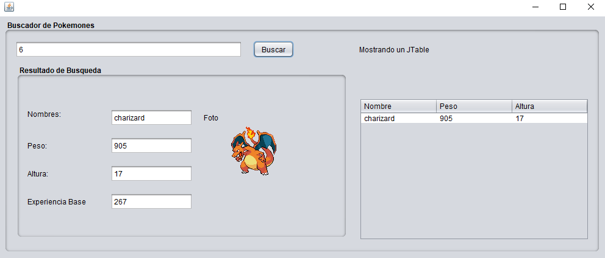

# JavaPokeApi

JavaPokeApi es una aplicación de escritorio simple desarrollada en Java que utiliza la PokeAPI para mostrar información sobre Pokémon en una interfaz gráfica de usuario.

## Captura de pantalla

## Características

- **Búsqueda por número o nombre:** Ingresa el número o el nombre de un Pokémon para buscar su información.
- **Visualización de datos:** Muestra datos como el nombre, peso, altura y experiencia base del Pokémon.
- **Interfaz gráfica intuitiva:** Diseño simple y fácil de usar.

## Requisitos previos

Antes de utilizar JavaPokeApi, asegúrate de tener instalado lo siguiente:

- Java Development Kit (JDK)
- Una conexión a Internet para acceder a la PokeAPI.

## Instalación

1. Clona o descarga este repositorio en tu computadora.
2. Abre el proyecto en tu IDE Java preferido (por ejemplo, Eclipse, NetBeans, IntelliJ IDEA).
3. Compila y ejecuta el proyecto.

## Uso

1. Ejecuta la clase `JavaPokeApi` para iniciar la aplicación.
2. Ingresa el número o el nombre de un Pokémon en el campo de búsqueda.
3. Presiona el botón "Buscar".
4. La información del Pokémon seleccionado se mostrará en la tabla y en los campos correspondientes.

## Contribución

Las contribuciones son bienvenidas. Si deseas mejorar JavaPokeApi, por favor sigue estos pasos:

1. Haz un fork del repositorio.
2. Crea una rama con tu nueva funcionalidad (`git checkout -b feature/nueva-funcionalidad`).
3. Realiza tus cambios y haz commit (`git commit -am 'Agrega nueva funcionalidad'`).
4. Sube tus cambios a tu repositorio (fork) (`git push origin feature/nueva-funcionalidad`).
5. Abre un pull request y describe tus cambios.

## Licencia

Este proyecto está bajo la [Licencia MIT](https://opensource.org/licenses/MIT). Puedes hacer lo que quieras con este código, pero agradecería mucho si me das crédito.

---

